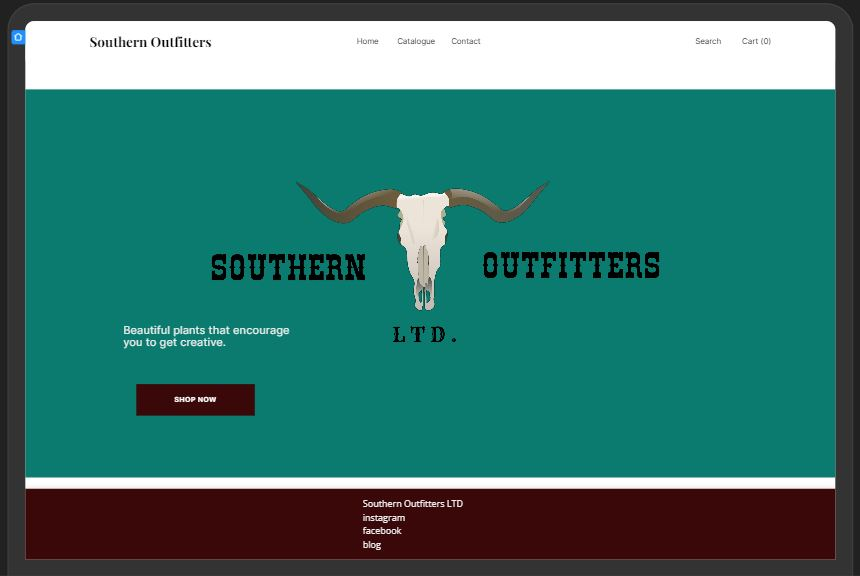
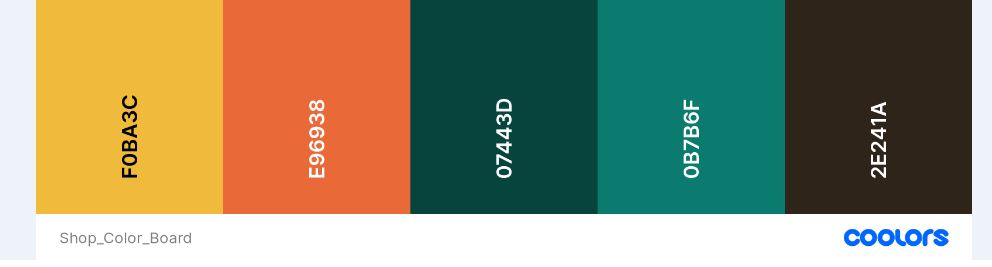
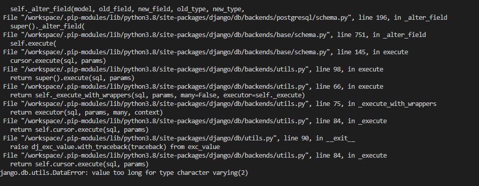

**Southern Outfitters Ltd**

Southern Outfitters Ltd is an outfitters specializing in American western wear for women in Ireland. 

You can view the live site here - <a href="https://southern-outfitters-ltd.herokuapp.com/" target="_blank"> Southern Outfitters Ltd. </a>

Please note this is not a completed project and alot of work remains to get it to a pass. 

# User Experience (UX)

## Strategy

### The Business Goals of the Website

To provide an online store suppling western wear to the Irish market. A resurgance of popularity in country music and shows like Yellowstone and Nashville, have made popular American brands sought after in Ireland. Many of these brands are currently unavailable to Irish audiences and so I believe there is a gap in the market for a shop specializing in western clothing. 

User Stories
***As Admin***

*   As a admin I can manage users accounts so that I can make any required changes to them if needed
*   As a admin I can manage products so that I can add , update or delete products when necessary
*   As a admin I can view create orders so that I can fulfill the orders or amend if needed
*   As a Admin I can delete any of comments so that I can remove them if I nolonger feel they are still necessary or needed
*   As a Admin I can view messages sent via contact form so that I can act upon them
*   As an admin I can manage the blog content so that I can make amendments if needed

***As a site user***
*   As a site user I can create or edit my account so that I can update my details accordingly
*   As a site user I can login in my account so that I can view my order history
*   As a site user I can search for products so that I can find specific products
*   As a site user I can sort products on criteria such as price and category so that I can I have a method of ordering the products products as I prefer
*   As a site user I can browse through products so that I can decide what I may be interested in buying
*   As a site user I can look at product details so that I can decide if I want to purchase it
*   As a site user I can easily add products I want to purchase to a basket so that I can decide whether to purchase or not
*   As a site user I can view the contents of my shopping basket so that I can be able to make any adjustments
*   As a site user I can update my bag by adding more or remove products so that I can decide on the number of products I intend to buy
*   As a site user I can view my order summary so that I can verify it before confirming
*   As a site user I can checkout securely so that I can I maintain the level of trust on the site
*   As a site user I can view paginated posts so that I can select which posts to view
*   As a site user I can view all posts so that I can decide what I may be interested in reading
*   As a site user I can comment to the blog posts so that I can express my opinion to the post
*   As a site user I can use the contact form so that I can contact the site owners
*   As a site user I can sign up to newsletter so that I can keep updated on the latest news*

## Scope 

To achieve the strategy goals create for the site, I wanted to implement the following features:

* A navigation bar at the top of the site that is responsive to user of the site and that is intuitive to the user
* A Login page for existing users to access their account to allow to like and add comments.
* A Register/Signup page to allow new users to create an account.
* A Footer located at the bottom of the website which allows the user to access social media links.
* A fully responsive design that will work on different devices including desktop, tablets, and mobile devices, allowing users to access the site anytime and anywhere.
* An Error 404 Page to allow users to redirect back to Home page in case of any errors.
* Full CRUD functionality for Admin to allow to create, read, update and delete posts.

### Agile Methodology

The Agile Methodology was used to plan this project. This was implemented through Github and developed throughout the project. 

Through the use of the Kanban board in the projects view in Github, the project was divided into a few different sections - To Do, In Progress and Done. 

Github issues were used to create User Stories for the project. This is where the project user was assigned; labels were added to show at a glance importance of tasks and help prioritize jobs. User story was added to the appropriate Iteration and the project [Kanban Board](https://github.com/users/ciaralynch72/projects/5).

## Structure

## Design

The design was centered around colors and imagery typically associated with the wild west. 

## Skeleton 

### Wireframes 
Southern Outfitters Ltd. was based upon Boutique Ado layout. I took aspects of what I liked about this and personalized it 
to how I like to view information. The layout is extremly simple. 
To be finished...

[Desktop Product View](media/assets/readme_images/desktop_product_wf.JPG)

### Database modal

The database model is simple and follows along the basis of the the boutique database structure. 

 Need to finish

### Colours

The colors were chosen based on what colors are typically associated with western lifestyles. 

- Turqoise

In Western culture, turquoise is beloved far and wide. For Native American tribes, turquoise was a foundation in their culture and spirituality dating back as early as the 5th century. The unique color of the stone represented protection, power, wealth, and health for native cultures.

- Yellow and Orange

These were chosen as sunsets are depicated all across western culture through the great plains of Montana and down to Texas and beyond. 

- Brown and Dark Green

These colors were chosen as they symobilse the earth and grass which is the core essense of western lifestyle. Afterall the west was born from those seeking elusive lands they could only dream about. 

### Typography 

The typography that was used was chosen was Inconsolata and Wellfleet as I had wanted to use something that would give the site visitor a familiar western feel with the old time lettering. 
### Imagery 

I created the main store graphic on canva and used unsplash and pexel to obtain the rest.  

## Features ##

- ### Home Page Features ###

Below is a list of current features for the website. 

- #### Header ####
A basic header with the name of the blog and the containing the navigation. The header and navigation are across all pages on the site.
It is reponsive across all device widths.

- #### Navigation ####
A responsive navigation bar that easily allows the user to navigate the site on mobile, table and website. 

- #### Alert Messages
Alert messages are used to let members know when they have logged in, out and submitted a comment form. 

TBC...

### Search Engine Optimisation (SEO)

#### ***Keywords***

I performed keyword reseach in order to figure out what would resonate with those looking for western wear in Ireland. 

Short-Tail Keyword – One to two words. Bigger audience
- Western Fashion
- Country Clothing
- Wrangler
- Cowboy boots
- Cowboy hat
- Western Outfitters
- Rural Rooted
- Wrangler
- Ariat 
- Irish Country
- Western Gifts 
- Fringed jackets
- Cowhide

Long-Tail Keyword – 
- Western wear Ireland
- Where can someone get western clothes in Ireland
- Real cowboy boots Ireland
- Western fashion Ireland
- Country concert clothing 
- Festival clothing Ireland

# Technologies Used

For this project the main languages used are __HTML5__, __CSS3__, __JavaScript__, __Python__, __Django__ and __Heroku Postgres__.

I have also utilised the following frameworks, libraries, and tools:

* [Bootstrap v5.1.3](https://getbootstrap.com/): 
    * Bootstrap has been used for overall responsiveness of the website and for the layout with the addition of select classes.
* [GitPod](https://www.gitpod.io/): 
    * I used GitPod as the IDE for this project and Git has been used for Version Control.
* [GitHub](https://www.github.com/): 
    * GitHub has been used to create a repository to host the project and receive updated commits from GitPod.
* [Uizard](https://uizard.io/): 
    * I used Uizard to create the wireframes for the site.
* [Figma](https://www.figma.com/): 
    * I used Figma to create the database diagram model for the site.
* [Google Fonts](https://getbootstrap.com/): 
    * I have used Google Fonts to import fonts for styling purposes for this project.
* [Font Awesome](https://fontawesome.com/): 
    * Font Awesome was used to apply icons in the Home, Exercises and Footer sections.
* [Chrome Dev Tools](https://developers.google.com/web/tools/chrome-devtools): 
    * Chrome Dev Tools was used to test the site, assist with debugging issues and run reports from Lighthouse.
* [W3C Markup Validation Service](https://validator.w3.org/): 
    * The W3C Markup Validation Service was used to validate the HTML document for this project and to identify any issues with the code.
* [W3C CSS Validation Service](https://jigsaw.w3.org/css-validator/): 
    * The W3C CSS Validation Service was used to validate the CSS document for this project and to identify any issues with the code.
* [PEP8CI](https://pep8ci.herokuapp.com/): 
    * The PEP8 Online Validation Service created by Code Institute was used to validate the Python document for this project and to identify any issues with the code.
* [Heroku](https://www.heroku.com/): 
    * Heroku has been used to create a repository to host the project and receive updated commits from GitPod.
* [Django](https://docs.djangoproject.com/en/3.1/): 
    * Django was used as the main framework to build this project.
* [Cloudinary](https://cloudinary.com/): 
    * Cloudinary was used to store all media and static files for this project.
* [Am I Responsive](http://ami.responsivedesign.is/):
    * Am I Responsive was used to create the header image for the README file.
* [Python](https://www.python.org/): 
    * Various Python modules were used to build this project as detailed below and as seen in the requirements.txt file.

## Bugs
I came across quite a few bugs while creating this project. A lot of them were typing errors, getting my URL paths correct, calling the wrong template, adding modules to installed apps. Alot of them actually helped me get a better understanding of what exactly I am at and they were important learning curves. 
My newly aquired bootstrap skills also were the fault of some bugs which I was able to rectify for the most part. 

* After setting up the countryfield and having previously added orders to the site I could not restart the site as my order had exceeded the country field limit. I was able to rectify this by deleting the previous orders and then making the migrations 

* Deleting a test entry that was in my shopping cart made my site not load. After going to slack I found out that I needed to delete the session cache and then the site loaded as normal
![Categories Error] Add photo

* Webhook handler was not showing as successful on the Strip site. After double/triple checking code I went to slack and found that the reason it was not working was that my workspace was not shared with Stripe. Sharing my workspace fixed this bug. 
Add image.....

### Known Bugs
* Many

# Deployment

This project was deployed using Github and Heroku.

- ## Github 

    * To create a new repository, I took the following steps:

        + Logged into GitHub.
        + Click the ‘repositories’ section.
        + Click the green ‘new’ button to create new repository.
        + Choose ‘repository template’ Used the code institute template as recommended from the dropdown menu.
        + Add repository name then clicked the green ‘create repository button’ at the bottom of the page.
        + Open the new repository and clicked the green ‘Gitpod’ button to create a workspace in Gitpod for editing.

- ## Django, Elephant SQL and Heroku

    To get the Django framework installed and set up I followed the Code institutes Boutique Ado walk through
    
    #### Final Deployment 
    DEBUG = False

    X_FRAME_OPTIONS = 'SAMEORIGIN' 

    In Heroku go to Reveal Congfig Vars  
    Remove Disbable_Collectstatic

    Go to Deploy Tab & Deploy Branch
   
- ## Clone Project 

    * Cloning of Project was made possible by GitHub
        + Go to Git Hub
        + Go to the repository 
        + Click on it to go to main repository site 
        + Click on the Code drop down button menu next to the greeen Gippod button
        + Click on HTTP section you will see the http of the repository click on the window next to it it will say copied
        + Clikced on Download and Zip
        + Clicked on Open with GitHubDesktop
 

## Credits
As you can already tell, I used Boutique Ado as the basis for this site

- #### Design
Design was inspired by the wild west

- #### Photos
Pexel
Unsplash

- #### Slack
I used Slack to find alot of questions, read about PP4 common pain points and check out other students projects for inspiration

- #### Mentor
My mentor Guido Cecilio has taken a break from mentoring but he did post some great resources on his student channel

- #### Cohort Facilitators
Code Institutes Facilitators were great throughout the project, answering questions and encouraging us to the finish line. They also made it easy to stay on track and keep everyone up to date. Thanks Kenan Wright and Kascia Bogucka.

- #### Cohort Facilitators
A big thank you to student care who gave me not one but two extensions after having to undergo knee reconstruction and allowing me to have time to heal but also to let me see the couse out. Than you Aoife especially for helping me with the extensions. 

- #### Cohort Students
Big thanks to my cohort for the positivity and encouragement in the slack group. Knowing everyone was in the same both with the jump in learning in JavaScript made it easier to get through this project. Special shoutout to Laura Maycock for sharing some great resources. 

- #### Code Institute and MSLETB
Big thank you to Code institute for creating such a great learning platform that gave me the tools and knowledge to create this website and for MSLETB for the opportunity to participate in this course. 

##### Thank You!
Thank you for taking time review my project. 